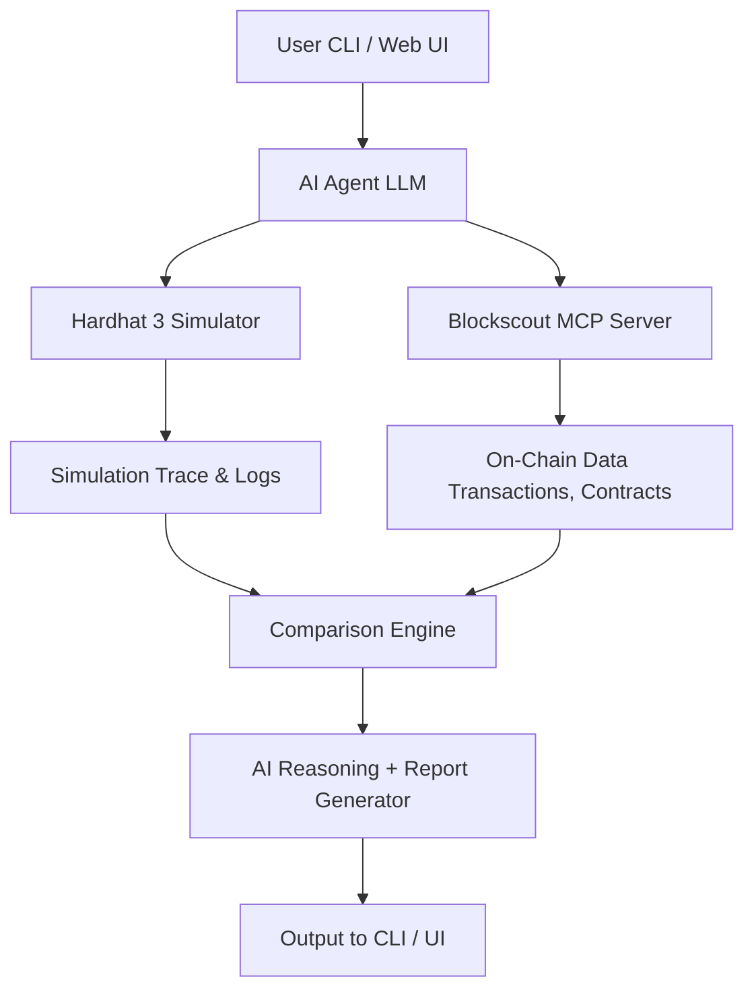

# 🧠 ChainSage AI  
### AI-Powered Smart Contract Analysis | Hardhat 3 + Blockscout MCP + Gemini AI

<div align="center">


**[🎥 Demo Video](#demo) • [📖 Documentation](#documentation) • [🚀 Quick Start](#quick-start) • [🏆 Hackathon](#hackathon)**

</div>

---

## � What is ChainSage AI?

**ChainSage AI** makes smart contract security accessible to everyone. Analyze any contract on any EVM chain in 30 seconds using AI-powered insights that would take security experts hours to uncover.

> **🎯 The Problem**: Smart contract vulnerabilities cost $3.8B in 2024. Manual audits are slow, expensive, and often miss subtle bugs.

> **✨ The Solution**: ChainSage combines local simulation (Hardhat 3), real-world blockchain data (Blockscout MCP), and AI reasoning (Google Gemini) to deliver instant, comprehensive security analysis.

### 🌟 Why ChainSage?

- ⚡ **30-Second Analysis** - Get comprehensive security reports instantly
- 🤖 **AI-Powered Insights** - Detect vulnerabilities humans miss
- 🌍 **Multi-Chain Support** - Works on Ethereum, Optimism, Base, Arbitrum & more
- 💰 **100% Free** - Powered by Gemini's generous free tier
- 🛡️ **Production-Ready** - Clean TypeScript, full error handling
- 🔓 **Open Source** - MIT licensed, fork and contribute!

---

## 🚀 Quick Start

```bash
# Install
npm install -g chainsage-ai

# Configure (add your free Gemini API key)
npx chainsage config

# Analyze any contract
npx chainsage analyze <contract_id> --network mainnet

# Get instant AI-powered security insights! 🎉
```

**Get your free Gemini API key**: https://aistudio.google.com/app/apikey

---

## ✨ Key Features

| Feature | Description |
|----------|-------------|
| ⚙️ **Local Simulation** | Run Solidity tests, traces, and gas analysis using Hardhat 3 (Rust-powered, multichain). |
| 🔍 **On-Chain Analytics** | Fetch real contract & wallet data via Blockscout MCP's multichain intelligence tools. |
| 🧠 **AI Reasoning Engine** | LLM agent (local or cloud) that interprets both datasets, explains contract logic, and compares outcomes. |
| 📦 **Batch Analysis** | Analyze multiple contracts at once with aggregate statistics. |
| 🎯 **Interactive Mode** | Guided wizard for easier CLI usage - perfect for demos! |
| 🔧 **Automated Fixes** | AI-generated code fixes for detected vulnerabilities. |
| ⚙️ **GitHub Actions** | CI/CD security analysis for your contracts. |
| 🪞 **Reality vs Simulation** | Shows how your simulated contract differs from real-world deployment behavior. |
| 🧰 **OP Stack Ready** | Use Hardhat 3's OP-Stack simulation to test cross-rollup contracts. |
| 🗣️ **Explain Transactions** | "Explain this tx hash" → AI describes function calls, value flow, and possible intent. |

---

## 🏗️ System Architecture



### ⚙️ Component Breakdown

1. **Hardhat 3 Engine** → Compiles, deploys, simulates contracts locally.
2. **Blockscout MCP Server** → Provides blockchain context: transactions, addresses, source code, analytics.
3. **AI Reasoner** → Uses context from both sources to explain, summarize, and detect inconsistencies.
4. **Frontend (optional)** → React + Vite dashboard for visual summaries.

---

## 🖥️ Example CLI Flow

### 🧪 Analyze a Smart Contract
```bash
npx chainsage analyze 0xA0b86991c6218b36c1d19D4a2e9Eb0cE3606eB48 -n ethereum
```

**AI Output:**
```
✅ Contract Verified: USD Coin
🔍 Security Score: 65/100
⚠️ Risks Identified: 3

CRITICAL RISKS:
  1. Admin Control Risk - Contract has centralized admin functions
  2. Upgrade Mechanism - Implementation can be changed
  
HIGH RISKS:
  3. Reentrancy Vulnerability - External calls before state changes

🧠 AI Insight: "This proxy contract implements upgradeability via admin-controlled
   implementation changes. Consider implementing timelock delays for upgrades."
```

### 📦 Batch Analysis
```bash
# Create a file with contract addresses
cat > contracts.txt << EOF
0xA0b86991c6218b36c1d19D4a2e9Eb0cE3606eB48
0xdAC17F958D2ee523a2206206994597C13D831ec7
0x6B175474E89094C44Da98b954EedeAC495271d0F
EOF

npx chainsage batch contracts.txt -n ethereum -o results.json
```

**Output:**
```
═══════════════════════════════════════════════════════
📊 BATCH ANALYSIS SUMMARY
═══════════════════════════════════════════════════════

Total Contracts: 3
Successful: 3
Failed: 0
Average Security Score: 72/100
Total Critical Issues: 2
Total High Issues: 5

Results saved to: results.json
═══════════════════════════════════════════════════════
```

### 🎯 Interactive Mode
```bash
npx chainsage interactive
```

**Guided Wizard:**
```
🧠 ChainSage AI - Interactive Mode

What would you like to analyze?
1. Smart Contract
2. Transaction
3. Compare Simulation vs Reality

Enter your choice (1-3): 1
Enter contract address: 0xA0b86991c6218b36c1d19D4a2e9Eb0cE3606eB48
Enter network: ethereum

🔍 Starting analysis...
✓ Contract: USD Coin
✓ Security Score: 65/100
⚠ Risks: 3 found
```

### 🔧 Automated Fix Suggestions
```bash
npx chainsage fix 0xYourContract -n ethereum -o fixes.json
```

**Output:**
```
═══════════════════════════════════════════════════════
🔧 AUTOMATED FIX SUGGESTIONS
═══════════════════════════════════════════════════════

1. Reentrancy Vulnerability
   Severity: CRITICAL

   Original Code:
   function withdraw(uint amount) public {
       require(balances[msg.sender] >= amount);
       msg.sender.call{value: amount}("");
       balances[msg.sender] -= amount;
   }

   Fixed Code:
   function withdraw(uint amount) public nonReentrant {
       require(balances[msg.sender] >= amount);
       balances[msg.sender] -= amount; // State change first!
       (bool success, ) = msg.sender.call{value: amount}("");
       require(success, "Transfer failed");
   }

   Best Practices:
   • Use OpenZeppelin's ReentrancyGuard
   • Follow Checks-Effects-Interactions pattern
```

### 🧱 Simulate Locally (Hardhat)
```bash
chainsage simulate ./contracts/StakingVault.sol
```

**Output:**
```
Simulating deployment with Hardhat 3...
✅ Compilation successful (Solc 0.8.27)
✅ 25 Solidity tests passed in 1.3s
🔍 Simulation complete — traced 45 function calls
🧠 AI Summary: "The staking contract locks tokens and emits correct events for deposits/withdrawals."
```

### 🔗 Compare with Real Deployment
```bash
chainsage compare 0xYourDeployedContract
```

**Output:**
```
🔬 Comparing Hardhat simulation vs on-chain activity...
- Function behavior match: 94%
- Gas deviation: +8.3%
- Event structure identical
🧠 Insight:
  "The deployed version uses a different compiler pragma and emits additional reward events.
   Consider aligning Hardhat config to pragma ^0.8.27 for accurate testing."
```

---

## 🛠️ Installation

### Prerequisites

- Node.js ≥ 20
- Hardhat 3 (v3.0.0+)
- Blockscout MCP Server credentials
- OpenAI / Local LLM (DeepSeek, Ollama, etc.)

### Setup

```bash
git clone https://github.com/<your-username>/chainsage-ai
cd chainsage-ai
npm install
npm run setup
```

### Environment Variables (`.env`)

```env
# Blockscout MCP Configuration
BLOCKSCOUT_MCP_URL=https://mcp.blockscout.com
BLOCKSCOUT_API_KEY=your_api_key_here

# LLM Configuration
LLM_PROVIDER=openai  # Options: openai, deepseek, ollama
LLM_MODEL=gpt-4
OPENAI_API_KEY=sk-...

# Hardhat Configuration
HARDHAT_NETWORK=sepolia
INFURA_API_KEY=your_infura_key
ETHERSCAN_API_KEY=your_etherscan_key

# Optional: Custom RPC Endpoints
MAINNET_RPC_URL=https://eth-mainnet.g.alchemy.com/v2/your-key
SEPOLIA_RPC_URL=https://eth-sepolia.g.alchemy.com/v2/your-key
```

---

## 🧪 Example Workflow

1. `hardhat compile` → Compile Solidity contracts.
2. `chainsage simulate` → Run local tests and gather traces.
3. `chainsage analyze 0xAddress` → Fetch real contract data from Blockscout MCP.
4. `chainsage compare` → AI explains simulation vs on-chain differences.
5. Output readable report in Markdown / JSON.

---

## 🧠 AI Reasoning Prompt

```
You are ChainSage, an AI blockchain researcher connected to the Hardhat 3 Simulator and Blockscout MCP Server.
For any given smart contract or wallet:

1. Simulate contract behavior using Hardhat 3.
2. Fetch on-chain transactions, approvals, and balances via Blockscout MCP.
3. Compare results and highlight differences.
4. Provide a human-readable summary of what the contract does, potential risks, and optimization tips.
```

---

## 🪙 Tech Stack

| Component | Tool |
|-----------|------|
| Smart Contract Engine | Hardhat 3 |
| Blockchain Data | Blockscout MCP |
| AI Reasoning | GPT-4 / DeepSeek (via MCP) |
| Backend | Node.js / TypeScript |
| UI (optional) | React + Vite |
| Visualization | Recharts, Mermaid |
| Language | Solidity, TypeScript |

---

## 📁 Project Structure

```
chainsage-ai/
├── contracts/              # Example Solidity contracts
│   ├── StakingVault.sol
│   └── SimpleToken.sol
├── test/                   # Hardhat tests
│   └── StakingVault.test.ts
├── src/
│   ├── cli/               # CLI interface
│   │   ├── index.ts
│   │   └── commands/
│   ├── core/              # Core modules
│   │   ├── hardhat-simulator.ts
│   │   ├── blockscout-client.ts
│   │   ├── ai-reasoner.ts
│   │   └── comparison-engine.ts
│   ├── utils/             # Utility functions
│   └── types/             # TypeScript types
├── hardhat.config.ts      # Hardhat 3 configuration
├── tsconfig.json          # TypeScript configuration
├── package.json
└── README.md
```

---

## 🏆 Submission Highlights

| Track | Eligibility | Value |
|-------|-------------|-------|
| Blockscout MCP | Fully MCP-integrated blockchain reasoning | AI contextual understanding |
| Hardhat 3 | Uses Hardhat 3 for simulation, testing & multichain ops | Deep developer relevance |
| Combined Impact | Real + Simulated Intelligence | Novel fusion of reasoning & dev tooling |

---

## 📝 License

MIT License - see [LICENSE](LICENSE) file for details.

---

## 🤝 Contributing

Contributions are welcome! Please read [CONTRIBUTING.md](CONTRIBUTING.md) for guidelines.

---

## 📧 Contact

For questions or support, please open an issue or contact the maintainers.

---

**Built with ❤️ for the blockchain developer community**
